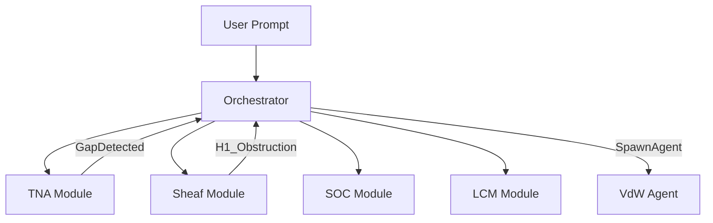

# AGEM System Architecture

> [!TIP]
> **TL;DR**: AGEM is a modular, event-driven framework using cellular sheaves for coordination and self-organized criticality (SOC) for state monitoring. It decouples reasoning (agents) from structural consistency (sheaf).

## Quick-Start Card

| Layer | Component | Function |
| :--- | :--- | :--- |
| **Coordination** | `CellularSheaf` | Multi-agent state consistency (ADMM) |
| **Monitoring** | `SOCTracker` | Criticality metrics (VNE, EE, CDP) |
| **Analysis** | `CooccurrenceGraph` | Semantic text network analysis (TNA) |
| **Memory** | `LifecycleContext` | Lossless context management (LCM) |
| **Auditing** | `LumpabilityAuditor`| Information loss detection in compression |

## Core Engine Modules

The AGEM engine is composed of five isolated modules that communicate exclusively via a central `EventBus`.

### 1. Sheaf Coordination (`src/sheaf/`)
Uses algebraic topology to ensure distributed agents remain consistent.
- **`CohomologyAnalyzer`**: Detects "structural holes" (H¹ obstructions) in agent discourse.
- **`SheafLaplacian`**: Computes the diffusion operator over the agent graph.
- **`ADMMSolver`**: Propagates consistency constraints between agent stalks.

### 2. Semantic Analysis (`src/tna/`)
Performs real-time Text Network Analysis on agent communication.
- **`GapDetector`**: Identifies under-connected concept communities.
- **`LayoutComputer`**: Spatialize semantic graphs via ForceAtlas2.

### 3. Criticality Tracking (`src/soc/`)
Monitors the system's "innovative health" via Self-Organized Criticality.
- **`RegimeValidator`**: Flags "System 1" early convergence (logic preceding evidence).

### 4. Context Management (`src/lcm/`)
Ensures no information is lost during long-running reasoning sessions.
- **`EscalationProtocol`**: Handles retrieval failures via deterministic fallback tiers.

### 5. Lumpability Auditing (`src/lumpability/`)
Audits the quality of context summaries.
- **`StrongLumpability`**: No information lost in transition.
- **`WeakLumpability`**: Minor drift detected; triggers recovery.

## Event-Driven Orchestration

Modules are wired in `src/orchestrator/ComposeRootModule.ts`. 

## Module Isolation Rules
- **Rule**: Modules must have zero cross-imports.
- **Verification**: Enforced by `npm test`.
- **Exception**: `ComposeRootModule` is the only bridge.
